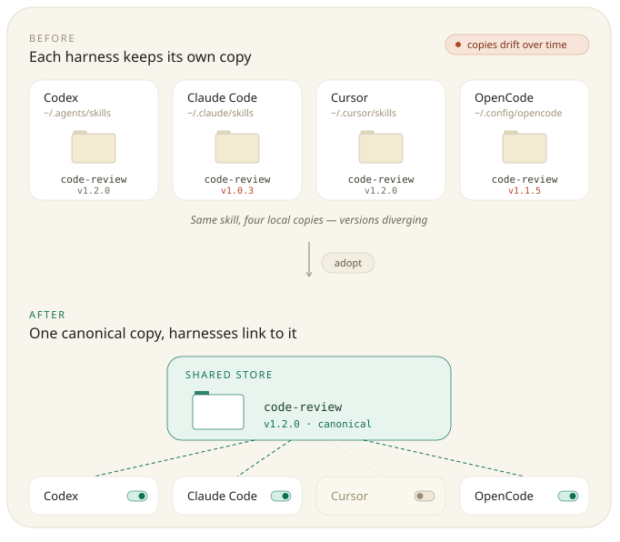
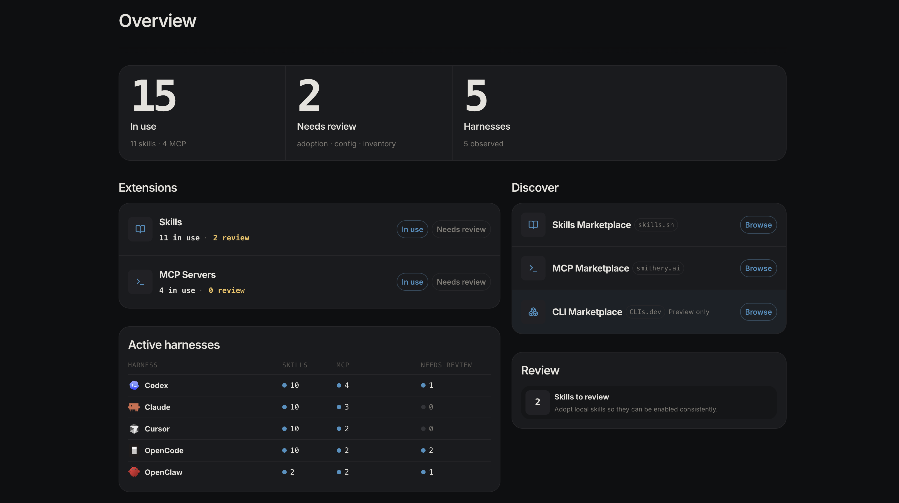
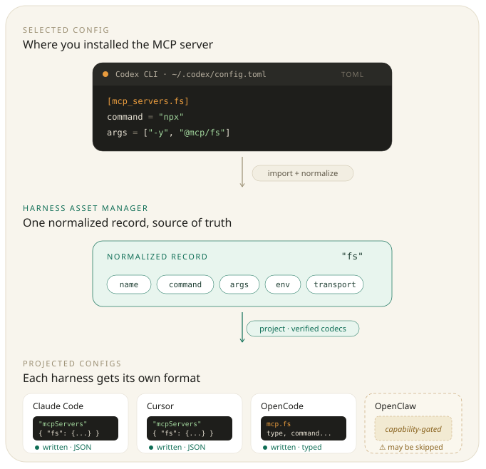

# harness-asset-manager

<p align="center">
  
</p>

<p align="center">
  <strong>A local-first control center for AI extensions.</strong><br />
  Use, review, and discover Skills, Agents, MCP servers, slash commands, hooks, and CLI tools across agent harnesses.
</p>

<p align="center">
  <a href="LICENSE"></a>
  <a href="https://github.com/execsumo/harness-asset-manager/releases/latest"></a>
  <a href="#install"></a>
  <a href="#install"></a>
  <a href="#local-first-safety"></a>
</p>



## What it does for you

AI extensions are scattered across harness-specific folders, MCP config files, slash command locations, and marketplace sources. **Harness Asset Manager** provides a single local control surface for managing, reviewing, and discovering extensions across all your AI coding tools and agent frameworks.

### Single Source of Truth & Cross-Harness Sync

- **Edit Once, Active Everywhere**: For file-based extensions (**Skills** and **Agents**), Harness Asset Manager uses managed symlinks to a single canonical store. Edit an asset in any enabled harness or in the shared store, and the changes are immediately active across every harness sharing the link.
- **Drift Detection & One-Click Sync**: For native config-based and rendered extensions (**MCP Servers**, **Slash Commands**, **Hooks**, and **Security Permissions**), Harness Asset Manager actively monitors local harness state. When you edit a native config in one harness, Harness Asset Manager detects the drift, flags it for review, and lets you adopt or sync the changes across all your other harnesses in one step.
- **Safe Conflict Isolation**: If multiple harnesses edit the same asset independently, Harness Asset Manager preserves both versions, prevents silent data loss, and lets you resolve conflicts safely.

### Key Capabilities

| Asset Family | What Harness Asset Manager does |
|---|---|
| **Skills** | Adopt local Skill folders into one shared inventory, then enable or disable them per harness using managed symlinks. |
| **Agents** | Store subagents as Markdown files with YAML frontmatter, symlinked (or rendered for Codex) across harnesses with automated drift repair and safe conflict resolution. |
| **MCP Servers** | Manage normalized MCP server configurations and translate them into native harness shapes (JSON, TOML, YAML). |
| **Slash Commands** | Maintain a single reusable prompt library and sync rendered command files into supported harness formats. |
| **Hooks** | Configure normalized event and tool category hook records, synced into native harness settings with drift detection and review for unmanaged entries. |
| **Permissions** | Enforce strict denylists across supported harnesses (Claude Code, Codex, Antigravity, and Cursor) to restrict shell commands, file paths, web domains, and MCP tools in a unified view. |
| **Configs & Audit** | Carry harness preferences between machines in one portable manifest that excludes secrets, absolute paths, and other families' keys — backed by an append-only JSON Lines audit journal. |
| **Marketplace** | Discover and preview Skills, MCP servers, and external CLI tools from marketplace hubs. |
| **Headless / CLI** | Drive all features headlessly via CLI commands with `--json` output—ideal for VPS environments, containers, or Linux sandboxes with no browser required. |

### Extension Statuses

Each asset family has a single "In use" page listing everything in that family — managed and
unadopted alike — with a status filter to narrow the view:

- **In use**: Harness Asset Manager controls the item and enables or disables it across harnesses.
- **Needs review** (filter): items Harness Asset Manager found in your harness configs but does not
  yet manage — unmanaged entries and configuration drift that require your decision. Adopt them
  inline from the same page; differing configs are resolved via a source-of-truth choice.
- **Discover**: Browse marketplaces and preview external tools.

---

## Supported Harnesses

Harness Asset Manager supports **7 AI agent harnesses** across **6 asset families**:

<table align="center">
  <tr>
    <td align="center" valign="middle">
      <br />
      <strong>Claude Code</strong><br />
      <a href="https://code.claude.com/docs/en/overview">Docs</a>
    </td>
    <td align="center" valign="middle">
      <br />
      <strong>Codex CLI</strong><br />
      <a href="https://developers.openai.com/codex/cli">Docs</a>
    </td>
    <td align="center" valign="middle">
      <br />
      <strong>Antigravity (agy)</strong><br />
      <a href="https://antigravity.google">Docs</a>
    </td>
    <td align="center" valign="middle">
      <br />
      <strong>Cursor</strong><br />
      <a href="https://cursor.com/docs">Docs</a>
    </td>
    <td align="center" valign="middle">
      <br />
      <strong>OpenCode</strong><br />
      <a href="https://opencode.ai/docs">Docs</a>
    </td>
    <td align="center" valign="middle">
      <br />
      <strong>Hermes Agent</strong><br />
      <a href="https://hermes-agent.nousresearch.com/docs">Docs</a>
    </td>
    <td align="center" valign="middle">
      <strong>Factory Droid</strong><br />
      <a href="https://docs.factory.ai/droid-cli/overview">Docs</a>
    </td>
  </tr>
</table>

Harnesses appear in this canonical order everywhere in the app—Settings and every resource matrix. The order is declared in `SUPPORTED_HARNESS_DEFINITIONS` (`harness_asset_manager/harness/catalog.py`). Disabling a harness in Settings drops its column across all matrices.

### Capability Matrix

| Harness | Skills | Agents | MCP Servers | Slash Commands | Hooks | Permissions |
|---|---:|---:|---:|---:|---:|---:|
| **Claude Code** | Yes | Yes | Yes | Yes | Yes | Yes (Denylist) |
| **Codex CLI** | Yes | Yes | Yes | Yes | Yes | Yes (Denylist) |
| **Antigravity (agy)** | Yes | Yes | Yes | Yes | Partial | Yes (Denylist) |
| **Cursor** | Yes | Yes | Yes | Yes | Yes | Yes (Denylist) |
| **OpenCode** | Yes | Yes | Yes | Yes | Partial | No |
| **Hermes Agent** | Yes | Best effort¹ | Yes | Yes² (Provisional) | Not Yet | No |
| **Factory Droid** | Yes | Yes | Yes | Yes | Not Yet | No |

<small>
¹ <strong>Hermes Agent</strong> does not currently document a native static-agent loader, but Harness Asset Manager can adopt, store, and symlink Markdown agent files under <code>$HERMES_HOME/agents/</code> for separate Hermes-side support or other tooling; Hermes will not consume them automatically.<br />
² <strong>Hermes slash-command</strong> support is provisional. Its command directory (<code>~/.hermes/commands</code>, frontmatter Markdown) follows common conventions but is not yet verified against a shipping Hermes build.<br />
Factory Droid hooks and permissions are not currently mapped because its hook scopes and command policy do not match HAM's global hook and denylist contracts.
</small>

Factory Droid support is currently best-effort and targets the personal/global
configuration under `~/.factory`. See [Factory Droid support](docs/factory-droid.md)
for the supported asset paths, project-scope boundaries, and documentation basis.

---

## How to Use It

### Install

#### Homebrew (macOS recommended)

```bash
brew tap execsumo/tap
brew install harness-asset-manager
harnessam start
```

`brew install harnessam` also works as an alias for the same formula.

If `harnessam: command not found` appears after installing, Homebrew's bin directory isn't on your `PATH` yet — run `eval "$(brew shellenv)"` and add that line to your shell profile (`~/.zprofile` or `~/.bash_profile`).

#### From Source / Local Development

```bash
git clone https://github.com/execsumo/harness-asset-manager.git
cd harness-asset-manager
scripts/install-dev.sh
```

### Quick Start

#### 1. Web Control Surface

Launch the background daemon and open the browser interface:

```bash
harnessam start
```

Or run the server directly in the foreground (for containers, systemd, or remote setups):

```bash
harnessam serve --no-open-browser --host 127.0.0.1 --port 8000
```

#### 2. Headless CLI Quick Reference

Every asset family managed by the Web UI is also accessible via the CLI:

```bash
# Matrix Overview
harnessam skills list                      # skills × harness matrix
harnessam agents list                      # agents × harness matrix
harnessam mcp list                         # mcp servers × harness matrix
harnessam hooks list                       # hooks × harness matrix
harnessam permissions list                 # permissions × harness matrix
harnessam commands list                    # slash commands list

# Management & Binding
harnessam agents enable release-bot --harness claude
harnessam skills set-harnesses lint-rule --target enabled
harnessam commands sync deploy --target claude --target codex
harnessam hooks set-harnesses lint-gate --target enabled

# Permissions
harnessam permissions create --id no-force-push \
    --decision deny --scope shell --pattern 'git push --force'

# Marketplace Installation
harnessam mcp install exa

# Configs & Settings
harnessam configs capture
harnessam settings show
```

All CLI commands accept `--json` for script integration:

```bash
harnessam skills list --json | jq -r '.rows[] | select(.displayStatus=="Unmanaged") | .skillRef'
```

---

## Product Tour

### Overview

Start with the Active harnesses table: per-harness coverage across skills, slash commands,
MCP servers, hooks, permissions, and agents, with a review column that totals everything
waiting for a decision. Every cell deep-links into the filtered capability view (and its
needs-review surface), so a glance turns directly into action, and an All-harnesses totals
row jumps to each capability's full catalog.

Below it sit two secondary panels. **Needs correcting** lists one notice per asset that
departs from the Agent Skills standard — naming the asset, saying what to fix, and linking
straight to its detail drawer, rather than reporting a count you then have to go hunt
through. **Review to Adopt** is a standing backlog of adoption and config work, styled
recessed on purpose: it is a queue, not an alert, and it should not compete with the
harness table for your attention.



### Skills

Use Skills as shared local packages instead of maintaining separate copies per harness.

Typical flow:

1. Review a Skill found in a harness or install one from the marketplace.
2. Adopt it into the Harness Asset Manager inventory.
3. Check what the package holds — `scripts/`, `references/`, `assets/` — before enabling it.
4. Enable it only where it should be available.
5. Update, remove, or delete it from one place.


### MCP Servers

Use MCP servers as one normalized config that can be written into each harness shape.

Typical flow:

1. Review an MCP server found in a harness or install one from the marketplace.
2. Adopt it into the Harness Asset Manager inventory.
3. Enable it where the server should be available.
4. Resolve config differences, disable harness bindings, or uninstall it from one place.


### Slash Commands

Use slash commands as one shared prompt library instead of rewriting the same command in each harness-specific format.

Typical flow:

1. Create a slash command with a name, description, and prompt.
2. Use `$ARGUMENTS` where runtime input should be inserted.
3. Sync it to supported harnesses.
4. Review existing harness command files and adopt them into the shared library when needed.


### Agents

Subagents you keep in one place instead of copy-pasting between harnesses.

Typical flow:

1. Write an agent — a name, a description, and a system prompt — or adopt one Harness Asset Manager found in a harness.
2. Turn it on for the harnesses that should have it.
3. In the detail editor, attach adopted Skills to the agent; the full list of adopted Skills is offered, and typing narrows it.
4. Review agents discovered in harness directories and adopt the ones worth keeping.

If a harness later edits an agent out from under Harness Asset Manager — some editors replace the link with their own copy — that edit is folded back in automatically, but only when it is provably the only edit. Conflicting edits are always left for you to resolve. See [Agents](#agents-1) below.

### Marketplace

Marketplace is the discovery surface:

- **Skills Marketplace**: browse and install Skills.
- **MCP Marketplace**: browse and install MCP servers.
- **CLI Marketplace**: preview external CLI tools from CLIs.dev. This is display-only; Harness Asset Manager does not install or manage CLIs.


---

## How It Works (Deep Dive)

### Store Layout

Harness Asset Manager keeps a flat store under its data directory: `skills/` holds one directory per skill, `agents/` holds one `<slug>.md` per agent, and each family's manifests sit alongside. Every binding into a harness points back here, so a resource is edited once and every harness that has it enabled follows.

Two earlier layouts are migrated one-time on first start — the pre-package `shared/` directory and the later `packages/local/` structure both fold into `skills/` and `agents/`. The migration is locked, idempotent, and skipped once the flat layout exists.

All six asset families support the same sidecar tagging model. Tags are stored in
`data/asset-tags.json`, never in asset documents or harness files; managed entries expose tags
in list/detail views, and the `starred` tag is available through the matrix star control and
URL-backed `?tag=starred` filter. Tag filters compose with each family's status and harness
filters. Unmanaged entries remain read-only for tagging.

Every tag editor suggests existing tags while you type, so a portfolio converges on a shared
tag vocabulary instead of splintering into near-duplicates. Families whose managed rows carry
select checkboxes (Skills, MCP Servers, Permissions) also support bulk tagging: select rows,
then use **Tag** in the bulk action bar to apply one or more tags to all selected assets at
once — tags are merged into each asset's existing set, never replaced.

### Skills

Before adoption, each harness points at its own local skill folder. After adoption, Harness Asset Manager keeps one canonical package in its shared local store and exposes it to selected harnesses with local links. Disabling a harness removes that harness binding without deleting the package.

Harness Asset Manager treats managed Skills as portable by default: once a Skill is adopted into the shared store, it can be enabled for any supported harness. `originHarness` is retained only as provenance.

Hermes Agent Skills use the categorized Hermes layout under `~/.hermes/skills/<category>/<skill>/SKILL.md`. Shared Skills enabled for Hermes are linked under the `harnessam` category by default. The legacy `harness-asset-manager` category remains readable so existing links continue to work. Harness Asset Manager excludes bundled Skills tracked by `.bundled_manifest` and official/builtin optional Skills recorded in Hermes hub provenance. Other valid Hermes Skill directories—including local or self-learned Skills with no `.hub/lock.json` entry—are surfaced as unmanaged and can be adopted; external hub provenance is retained when available. Hermes-owned bundled and official optional folders remain untouched until explicitly adopted or managed.

Every managed Skill is checked against the [Agent Skills specification](https://agentskills.io/specification)
— `name` charset and length, `name` matching its package directory, `description` presence and
length. The results are **advisory and never block anything**: HAM keys Skills on their package
directory and treats `name` as a display name, so enforcing the spec would retroactively
invalidate Skills that work perfectly well. Departures appear as **Standards check** notes on
the Skill's detail view and as notices on the Overview, each phrased as the correction to make.
This is HAM's own check — there is no external validator and no extra dependency.

Adoption takes the **whole folder**, not just `SKILL.md` — `scripts/`, `references/`, `assets/`,
and anything else the package ships travel with it, and harnesses bind to it with a directory
symlink. The detail view's **Package contents** section says what is in there: each top-level
entry with its file count, folders collapsed so a large package stays readable, and `scripts/`
badged as executable material so you can see whether a Skill ships code before enabling it
somewhere that will run it.

Editing a Skill's document in place preserves its frontmatter exactly, including nested
structures — `metadata:` maps, `tags:` lists, lists of maps, and literal `|` blocks — and
re-quotes any scalar that would not be valid YAML unquoted. A frontmatter value spanning
several lines is edited in a text area so its indentation stays intact.

Skills can be starred or assigned free-form tags from the matrix or detail view. Tag chips and
filters use the shared sidecar store, while the star is surfaced as the pinned `starred` system
tag.


### MCP Servers

MCP servers are stored as normalized Harness Asset Manager records, then translated into the config shape each harness expects:

- Codex uses TOML under `mcp_servers`.
- Claude Code and Cursor use `mcpServers` JSON entries.
- OpenCode uses typed local/remote MCP entries.
- Antigravity (agy) uses `mcpServers` JSON entries with `serverUrl` for HTTP transports and `command`/`args`/`env` for stdio.
- Hermes Agent uses YAML under `mcp_servers` in `~/.hermes/config.yaml` (or `$HERMES_HOME/config.yaml`).
- Factory Droid uses JSON under `mcpServers` in `~/.factory/mcp.json`.

When Harness Asset Manager finds different configs for the same MCP server, it asks you to resolve the source of truth first.

MCP servers support the shared managed-entry tagging controls: star a server in the matrix,
edit tags in its detail view, or filter the page with `?tag=`.



### Slash Commands

Slash commands are stored as TOML records under Harness Asset Manager app storage, then rendered into each supported harness format:

- Claude Code writes Markdown command files under `~/.claude/commands` and invokes them with `/`.
- Codex writes prompt files under `~/.codex/prompts` and invokes them with `/prompts:`.
- Cursor writes plain text command files under `~/.cursor/commands` and invokes them with `/`.
- OpenCode writes Markdown command files under `~/.config/opencode/commands` and invokes them with `/`.
- Antigravity (agy) writes Markdown command files under `~/.gemini/antigravity-cli/commands` and invokes them with `/`.
- Factory Droid writes Markdown command files under `~/.factory/commands` and invokes them with `/`.

Disabling a harness in Settings removes its column here immediately, without a restart. Command files already written to that harness and their sync records are left alone — re-enabling it restores the column and its sync state unchanged.

Harness Asset Manager tracks target ownership with sync state and content hashes. With slash-command auto-adoption enabled, it adopts only equivalent unmanaged command files and never overwrites their contents. Otherwise it reports unmanaged, changed, or missing files for review. Review actions let you adopt unmanaged commands, restore managed content, adopt a changed harness command as the new source, or remove a broken binding while leaving the harness file untouched.

Slash commands support the shared managed-entry tagging controls, including matrix starring,
detail tag chips, and URL-backed tag filters.

### Hooks

Hooks are stored as normalized Harness Asset Manager records using **canonical events** (`pre_tool_use`, `post_tool_use`, `user_prompt_submit`, `session_start`, `stop`, `pre_compact`) and **canonical tool categories** (`shell`, `file_read`, `file_write`, `mcp`, `web`, `any`). Each harness codec translates a canonical record into that harness's native event names and config shape, and merges it into the harness's hook config:

- Claude Code writes hook entries into `~/.claude/settings.json` under the `hooks` key.
- Codex writes inline `[hooks]` tables into `~/.codex/config.toml` (same event schema as Claude).
- Cursor writes `~/.cursor/hooks.json`, expressing each tool category as its dedicated event (`beforeShellExecution`, `afterFileEdit`, `beforeMCPExecution`, and so on).
- OpenCode writes `experimental.hook` entries in `opencode.json` — limited to `file_edited` (post-edit on write) and `session_completed` (stop), so coverage is partial.
- Antigravity (agy) writes a name-keyed `~/.gemini/config/hooks.json` (discovering entries across user-level `~/.gemini/*/hooks.json` and project-level `.agents/hooks.json`), matching against tool names (`run_command`, `view_file`, …); it covers tool, stop, and (via `PreInvocation`) prompt-submit hooks, so coverage is partial.
- Factory Droid hooks are not currently managed. Droid has user, project, enterprise, and legacy hook scopes with lifecycle and matcher semantics that do not map safely to HAM's canonical hook model.

Because harnesses differ, not every canonical event maps to every harness. Harness Asset Manager exposes a **representability matrix** showing where each hook can sync and where it cannot, including caveats — for example, an Antigravity `user_prompt_submit` hook maps to `PreInvocation`, which fires before every model invocation rather than only on prompt submit.

Harness Asset Manager owns only the specific hook entries it writes. It merges into each harness's config without disturbing hooks or other keys it does not manage, and it tracks ownership with content hashes. When a managed hook is edited outside Harness Asset Manager it is reported as drifted, and hooks found in a harness that Harness Asset Manager does not manage are reported as unmanaged for review.

Hooks support the shared managed-entry tagging controls, including matrix starring, detail tag
chips, and URL-backed tag filters.

### Agents

Agents are Markdown files with YAML frontmatter and the system prompt as the body. They live in Harness Asset Manager's store; enabling one for a harness symlinks it into that harness's agents directory, so editing the agent once updates it everywhere it is enabled.

Harness Asset Manager's standard agent frontmatter contract is `name`, `description`, `model`, `effort`, `tools`, and `skills`. The detail editor exposes those fields directly; `skills` accepts only adopted HAM Skills and offers them as suggestions. Saving an agent automatically enables each attached Skill on installed harnesses where that agent is enabled. Removing a Skill from the agent is non-destructive and does not disable existing Skill bindings.

`effort` is a **fixed vocabulary** — `low`, `medium`, `high`, or empty to clear the key — so the editor offers a picker rather than a text box, and the API rejects anything else with a 400. That keeps a typo, a raw-YAML edit, or a hand-edited file from writing a value no harness understands. An agent authored elsewhere that already carries an out-of-contract value keeps it: the picker offers it as a labelled option rather than silently rewriting it, so you decide what it becomes. `model` is deliberately free text — its value set is open-ended.

Other frontmatter keys — Claude's `permissionMode`, `maxTurns`, and `hooks`; Cursor's `readonly` and `is_background`; Codex's `sandbox_mode` — remain custom configuration and are preserved on edit. The detail view lists those keys verbatim under **Configuration**, so a new harness field shows up without code changes here. The only keys dropped on write are `capabilities:` and `harnesses:` from the retired compile model, which nothing reads.

The agents matrix shows the same harnesses as every other family — whichever you have enabled in Settings:

| Harness | Location | How it is installed |
|---|---|---|
| Claude Code | `~/.claude/agents/` | symlink |
| Cursor | `~/.cursor/agents/` | symlink |
| Antigravity | `~/.gemini/antigravity-cli/agents/` | symlink |
| OpenCode | `$XDG_CONFIG_HOME/opencode/agents/` | symlink |
| Codex | `~/.codex/agents/` | rendered TOML |
| Hermes | `$HERMES_HOME/agents/` (normally `~/.hermes/agents/`) | symlink; best effort¹ |
| Factory Droid | `~/.factory/droids/` | symlink |

Most harnesses read the same Markdown format the store holds, so enabling one symlinks the store file into place — edit the agent once and every harness it is enabled for follows. **Codex** is the exception: it reads TOML with different keys (`name`, `description`, `developer_instructions`), so Harness Asset Manager renders a real file marked `# harness-asset-manager:generated`. Local edits to a rendered file are reported but never adopted — re-enabling overwrites them. **Hermes** is best effort: HAM can manage the files in its conventional agents directory, but Hermes does not consume them automatically without separate Hermes-side support.

Harness Asset Manager only ever removes files it owns — a symlink into its store, or a file carrying its generated marker. Anything else in a harness's agents directory is reported as **unmanaged** for review, never overwritten. Adopting one moves it into the store (converting Codex TOML to Markdown) and installs it back. If the name is already taken in the store, Harness Asset Manager refuses to guess and asks which version to keep.

Agents support the shared managed-entry tagging controls, including matrix starring, detail tag
chips, and URL-backed tag filters.

#### Agent Skills

The agent detail editor can attach adopted Skills through the `skills:` frontmatter list. HAM
validates each slug against the managed Skills inventory, suggests adopted Skills while typing,
and automatically enables newly attached Skills on every installed harness where the agent is
enabled. Removing a Skill from an agent only changes that agent's frontmatter; it never removes
a Skill binding that may be used independently.

#### When a harness breaks the link

Some editors save a file by writing a temporary file and renaming it over the target. Renaming over a symlink **replaces the symlink** with a regular file, so a harness that edits an agent through its own UI can silently turn a binding into an ordinary copy — and from then on the two versions drift apart. (Skills are immune to this: they bind as directory symlinks, and renaming a directory over one fails at the kernel.)

Harness Asset Manager records every binding it makes in `bindings.json`: which agent went to which harness, and what the store held at that moment. That record is what makes the difference between "a harness broke our link" and "an unrelated file happens to share this name" decidable — without it, the two are the same observation. The record is a cache, never a source of truth; if it disagrees with the filesystem, the filesystem wins. Deleting it costs you the automation, never your content.

On the next inventory load, each broken binding is classified and handled:

| What is found | What happens |
|---|---|
| The copy is identical to the store | The link is restored. There is no content decision to make. |
| The copy was edited, and the store has not changed since it was linked | That copy holds the only edit in existence, so it is adopted into the store and every binding for that agent is restored. |
| The copy was edited **and** the store changed too | Nothing. Both sides hold work; choosing either discards the other. Reported for you to resolve. |
| Several harnesses were edited differently | Nothing is adopted and nothing is deleted. Each version is preserved under `agents/conflicts/`, with one issue naming every side. |
| There is no record of a binding here | Nothing. This is an ordinary name collision, and you are asked, as before. |

Newest-file-wins is deliberately **not** a rule here — it silently discards the other harness's work, which is the exact failure this exists to prevent. Codex is excluded from automatic adoption entirely, because converting its TOML back to Markdown drops keys Harness Asset Manager does not model.

Every automatic action is appended to the Activity audit log: repair you cannot see is nearly as bad as breakage you cannot see. Agent-specific repairs are also shown under **Recent automatic repairs** on the agents page's Needs-review view. Each family has its own setting, and turning one off takes effect on the next load, not the next restart.

### Permissions

Denylist rules restrict shell commands, file paths, web domains, and MCP tools across supported harnesses in a single unified view. Only `--decision deny` binds to harnesses today — Harness Asset Manager is denylist-only. Each rule carries a canonical scope (`shell`, `file_read`, `file_write`, `web`, `mcp`, `any`) and a pattern that is matched according to that scope:

- `shell` → `git push`
- `file_read` / `file_write` → `~/.zshrc`
- `web` → `api.example.com`
- `mcp` → `server/tool`

Enabling the first rule for a harness also selects that harness's no-prompt execution mode, so unlisted actions proceed and only recorded deny rules are blocked; disabling the last rule restores the native default.

The permissions matrix behaves like every other family view: sortable rule, harness, and applied-count columns, plus a select checkbox on each row. Managed rules support bulk apply, remove, delete, and tag; untracked rules support bulk adopt.

Each harness codec translates rules into that harness's native deny surface:

- Codex's native config currently supports HAM's file and web deny rules, but not shell-command or MCP deny rules.
- Cursor maps rules onto deny tokens in `~/.cursor/cli-config.json` — `Shell()`, `Read()`, `Write()`, `WebFetch()`, `Mcp()`. Multi-token shell patterns and bare-server MCP patterns are correctly reported unsupported, since Cursor's own tokens can't express either. Enabling a Cursor rule writes `approvalMode = "unrestricted"`; disabling the final rule cleans it up.

Permissions support the shared managed-entry tagging controls. Permission tags are keyed by the
stable permission spec ID, so a rule can be starred, grouped with free-form tags, and found via
`?tag=` without changing its native deny configuration.

Only Cursor's separate CLI (`cursor-agent`) is targetable at all — its IDE Agent reads an entirely different `permissions.json` that is allowlist-only, with no deny/enforcement surface, so it stays permanently out of scope for this model.

### Configs

Carry your harness *preferences* — model, theme, effort, and the rest — between machines.
Harness Asset Manager extracts them from each harness's user-level config into one portable
manifest at `~/.harnessam/configs/manifest.json`, which syncs with the store. Managed from
Settings > Configuration Preferences, or `harnessam configs list|capture|restore|diff`.

A key is carried only when it is genuinely portable. Anything that is owned by another
family (`permissions`, `hooks`, `mcpServers`, …), looks like a secret, or contains an
absolute path is left behind — and those two checks recurse, so a credential nested deep
inside a provider map is dropped along with the key holding it. The result is that the
manifest is safe to commit next to the rest of your dotfiles.

**Restore is a merge, never a rewrite.** Only the managed preference keys are written back;
every other key in the file survives untouched — comments and formatting included, in every
supported format — and restoring an unchanged capture leaves the file byte-for-byte
identical.

Automatic capture is deliberately conservative: because the manifest travels between
machines, a local file that has diverged from the manifest is left for you to resolve
explicitly rather than being captured over the top of another machine's edit.

Droid/Factory has no entry — its only config file is MCP-owned, which the MCP family
already manages.

### Mutation Audit Journal

Trace every Web UI, API, and CLI mutation in an append-only JSON Lines journal, including the operation, outcome, and filesystem paths changed—without recording prompts, config payloads, or secrets.

---

## Local-first Safety

Harness Asset Manager is a local configuration-management tool. It runs on your machine and reads or writes local harness extension state.

Actions that can change local state include:

- adopting a local skill folder
- enabling or disabling a skill for a harness
- updating a source-backed skill
- removing or deleting a skill
- installing an MCP server into a selected harness config
- adopting an existing MCP config
- enabling, disabling, resolving, or uninstalling an MCP server
- creating, updating, syncing, importing, or deleting a slash command
- creating, enabling, disabling, resolving, or deleting a hook binding
- changing harness support settings
- repairing a drifted agent binding, which can move an edit out of a harness file and into the store

Automatic adoption is opt-in per asset family, except for the existing safe Agent repair default. It is limited to equivalent observations or cases where a harness copy is provably the only edit, and every action is recorded in the Activity audit log.

| Family | Default | Automatic behavior when enabled |
| --- | --- | --- |
| Agents | On | Repair provable drift; conflicting edits remain for review. |
| Skills | Off | Adopt new, equivalent unmanaged local directories and replace them with store links. |
| Slash commands | Off | Register equivalent unmanaged files without overwriting their contents. |
| MCP, Hooks, Permissions | Off | Promote equivalent unmanaged observations without choosing between conflicting configurations. |

These checks run while reading the relevant inventory or detail view, so a setting change takes effect on the next read; there is no background watcher. Codex rendered-agent adoption remains excluded because its TOML-to-Markdown conversion is not lossless. When the UI is closed, run `harnessam refresh` for one read and reconciliation pass across all asset families; use `harnessam refresh --json` for automation.

App-owned files live under `~/.harnessam` on macOS and Linux. Existing XDG `harnessam` and `harness-asset-manager` stores are migrated automatically and retained as compatibility aliases.

---

## Headless and CLI Reference

Every asset family the Web UI manages is also available as a CLI command. Nothing needs to be running first: the CLI builds the same backend the server does and talks to the same stores, so it works on a VPS, in a container, or in a Linux sandbox with no browser and no daemon.

### Command Reference

Every command takes `--json` and `--state-dir`. `--harness` names a harness id (`claude`, `codex`, `agy`, `cursor`, `opencode`, `hermes`, `droid`), and `set-harnesses --target enabled|disabled` applies one state to every interactive cell in that row. Run `harnessam <group> <verb> --help` for the full flag list.

**`skills`** — Skills inventory and the skills marketplace.

| Command | What it does |
| --- | --- |
| `skills list` | The skills × harness matrix, plus a managed/unmanaged count |
| `skills show <ref>` | Detail: status, per-harness cells, on-disk locations |
| `skills enable\|disable <ref> --harness <h>` | Bind or unbind one harness |
| `skills set-harnesses <ref> --target <state>` | Apply one state everywhere |
| `skills manage <ref>` / `skills manage-all` | Take unmanaged skills into the store |
| `skills unmanage <ref>` | Stop managing, leaving the files in place |
| `skills update <ref>` | Re-fetch a managed skill from its source |
| `skills delete <ref> --yes` | Delete a managed skill and its bindings |
| `skills search <query>` / `skills popular` | Browse the marketplace; prints install tokens |
| `skills install <install-token>` | Install a marketplace skill |

**`agents`** — Subagents stored as markdown and symlinked into each harness.

| Command | What it does |
| --- | --- |
| `agents list` | The agents × harness matrix, including unmanaged harness copies |
| `agents show <ref>` | Detail: prompt, tools, per-harness path and install method |
| `agents create --name --description --prompt\|--prompt-file [--tool …]` | Create an agent in the store |
| `agents update <ref> [--name] [--description] [--prompt] [--tool …]` | Change one or more fields |
| `agents enable\|disable <ref> --harness <h>` | Bind or unbind one harness |
| `agents set-harnesses <ref> [--harness <h> …]` | Bind to exactly this set; omit all to unbind everywhere |
| `agents adopt <ref> [--on-conflict keep_store\|replace_store]` | Take a harness-owned agent into the store |
| `agents adopt-all` | Adopt every unmanaged agent |
| `agents delete <ref> --yes` | Delete an agent and its bindings |

**`mcp`** — MCP servers and the MCP marketplace.

| Command | What it does |
| --- | --- |
| `mcp list` | The servers × harness matrix |
| `mcp show <name>` | Detail: transport, command/url, per-harness state |
| `mcp install <qualified-name>` | Install from the marketplace |
| `mcp uninstall <name> --yes` | Remove a managed server and its bindings |
| `mcp enable\|disable <name> --harness <h> [--config <json>]` | Bind or unbind one harness |
| `mcp set-harnesses <name> --target <state> [--config <json>]` | Apply one state everywhere |
| `mcp check <name>` | Probe availability; exits `1` when unavailable |
| `mcp unmanaged` | Servers found in harness configs that we do not own |
| `mcp adopt <name> [--observed-harness <h>] [--harness <h> …]` | Take an unmanaged server into the store |
| `mcp search <query>` / `mcp popular` | Browse the marketplace |

`--config` takes a JSON object, or `@file` / `@-` to read one from a file or stdin.

**`hooks`** — Normalized hook records synced into harness settings.

| Command | What it does |
| --- | --- |
| `hooks list` | The hooks × harness matrix |
| `hooks show <id>` | Detail: event, command, match, per-harness state and drift |
| `hooks create --id --event --command [--match] [--timeout] [--description]` | Create a managed hook |
| `hooks enable\|disable <id> --harness <h>` | Bind or unbind one harness |
| `hooks set-harnesses <id> --target <state>` | Apply one state everywhere |
| `hooks promote <id> [--observed-harness <h>]` | Take a harness-owned hook into the store |
| `hooks delete <id> --yes` | Delete a hook and its bindings |

`--event` is one of `pre_tool_use`, `post_tool_use`, `user_prompt_submit`, `session_start`, `stop`, `pre_compact`. `--match` is a tool *category* — `any`, `shell`, `file_read`, `file_write`, `mcp`, `web` — not a harness tool name; each harness maps the category to its own matcher.

**`permissions`** — Denylist rules across supported harnesses.

| Command | What it does |
| --- | --- |
| `permissions list` | The rules × harness matrix |
| `permissions show <id>` | Detail: decision, scope, pattern, per-harness state |
| `permissions create --id --decision --scope [--pattern] [--description]` | Create a managed rule |
| `permissions enable\|disable <id> --harness <h>` | Bind or unbind one harness |
| `permissions set-harnesses <id> --target <state>` | Apply one state everywhere |
| `permissions promote <id> [--observed-harness <h>]` | Take a harness-owned rule into the store |
| `permissions delete <id> --yes` | Delete a rule and its bindings |

**`commands`** — Slash commands and their per-target renders.

| Command | What it does |
| --- | --- |
| `commands list` | Commands with their synced targets, plus anything needing review |
| `commands targets` | The available targets and whether each is enabled and available |
| `commands show <name>` | Detail: per-target sync status, path, and the prompt body |
| `commands create --name --description --prompt\|--prompt-file [--target …]` | Create and sync |
| `commands update <name> --description --prompt\|--prompt-file [--target …]` | Update and re-sync |
| `commands sync <name> [--target …]` | Re-render into the selected targets |
| `commands delete <name> --yes` | Delete the command and its renders |

**`settings`, `snapshots`, `health`**

| Command | What it does |
| --- | --- |
| `settings show` | Storage paths, per-harness support and install state, auto-adopt |
| `settings harness <h> --enable\|--disable` | Turn support for a harness on or off |
| `settings auto-adopt <agents\|skills\|slash_commands\|mcp\|hooks\|permissions> --enable\|--disable` | Control opt-in automatic adoption and repair |
| `refresh [--sync-all]` | Run inventory pass; `--sync-all` enforces auto-adoption & drift reconciliation across all asset families |
| `configs list` | Captured portable preferences per harness |
| `configs capture` | Extract preferences from every harness config into the manifest |
| `configs diff <harness>` | Compare a harness's live config against the manifest |
| `configs restore <harness>` | Merge managed preferences back into the live config |
| `health` | Health summary — app, harness count, home dir; useful as a readiness probe |

### Scripting Guidelines

- `--json` on any command prints the exact payload returned by the corresponding API route — stdout stays clean for `jq`, while errors go to stderr.
- Exit codes: `0` success, `1` a refused or partly-applied mutation, `2` bad usage. A fan-out like `set-harnesses` exits `1` when any harness rejects the change; check `succeeded`/`failed` in JSON when partial application is acceptable.
- Destructive commands (`delete`, `uninstall`) prompt when stdin is a terminal and refuse otherwise — pass `--yes` in scripts.
- `--state-dir` isolates a run, including HAM's store, settings, runtime files, and
  catalog-resolved harness paths, ensuring CI or throwaway sandboxes do not touch the
  primary store or native harness configuration. It overrides `HOME` and the XDG base
  directories for that invocation.

```bash
harnessam skills list --json | jq -r '.rows[] | select(.displayStatus=="Unmanaged") | .skillRef'
harnessam agents set-harnesses release-bot --harness claude --harness codex --json | jq .failed
```

Running the CLI while the app is serving is completely safe — stores serialize writes with `flock`, and the server's read models refresh within a second.

### Running the Server Headlessly

`serve` runs in the foreground (systemd, Docker, `tmux`); `start` daemonizes and records a pid that `status` and `stop` read back.

```bash
harnessam serve --no-open-browser --host 127.0.0.1 --port 8000
```

A missing `frontend/dist` is fine — the API serves normally and only the HTML shell is a placeholder. Binding a non-loopback address needs `--allow-remote`; see [Local-first safety](#local-first-safety) first, because the API has no authentication.

---

## Configuration

On macOS and Linux, app-owned files live under `~/.harnessam`. Explicit XDG overrides remain supported for isolated/test runs. Existing `harnessam` and `harness-asset-manager` directories are migrated automatically on first use.

### Path Locations

Useful macOS paths:

- skills store: `~/.harnessam/skills`
- agents store: `~/.harnessam/agents`
- agent binding ledger: `~/.harnessam/bindings.json`
- agent repair audit log: `~/.harnessam/agents-audit.json`
- mutation audit journal: `~/.harnessam/audit.log` (append-only JSON Lines)
- preserved conflicting agent copies: `~/.harnessam/agents/conflicts`
- MCP manifest: `~/.harnessam/mcp/manifest.json`
- hooks manifest: `~/.harnessam/hooks/manifest.json`
- slash command library: `~/.harnessam/slash-commands/commands`
- slash command sync state: `~/.harnessam/slash-commands/sync-state.json`
- marketplace cache: `~/.harnessam/marketplace`
- app settings: `~/.harnessam/settings.json`

Useful Linux paths:

- skills store: `~/.harnessam/skills`
- agents store: `~/.harnessam/agents`
- agent binding ledger: `~/.harnessam/bindings.json`
- agent repair audit log: `~/.harnessam/agents-audit.json`
- mutation audit journal: `~/.harnessam/audit.log`
- MCP manifest: `~/.harnessam/mcp/manifest.json`
- hooks manifest: `~/.harnessam/hooks/manifest.json`
- slash command library: `~/.harnessam/slash-commands/commands`
- slash command sync state: `~/.harnessam/slash-commands/sync-state.json`
- marketplace cache: `~/.harnessam/marketplace`
- app settings: `~/.harnessam/settings.json`

### Carrying the store between your own devices

The Harness Asset Manager store (`~/.harnessam` on macOS and Linux, or your explicit XDG roots — the same paths described above) is designed to be portable across your own machines using standard dotfile or folder synchronization tools (a Git dotfile repo, Syncthing, Dropbox, iCloud, Nextcloud, rsync). This is a supported workflow, not an accident: every persisted reference that names a file stores it home-relative (`~/...`), so the store survives different usernames, operating systems, and home locations (`/Users/alice` ↔ `/home/bob`).

#### Portable Paths
All persisted references (such as agent binding ledgers and slash command sync state) store home-relative paths (`~/...`). This allows your store to travel seamlessly between devices with different usernames, operating systems, or home locations (for example, `/Users/alice` on macOS and `/home/bob` on Linux).

#### What to Sync vs Ignore

HAM automatically creates a default `.gitignore` inside `~/.harnessam` on first start to keep sync repositories clean:

- **Sync (portable assets & configuration)**:
  - `skills/` and `skills-manifest.json` (Skill packages and metadata)
  - `agents/` (Subagent Markdown definitions)
  - `mcp/manifest.json` (Normalized MCP server configurations)
  - `hooks/manifest.json` (Hook rules)
  - `permissions/manifest.json` (Denylist policies)
  - `slash-commands/commands/` (Prompt library)
  - `slash-commands/sync-state.json` (Slash command sync state)
  - `bindings.json` (Agent binding cache)
  - `settings.json` (App preferences and harness support toggles)

- **Ignore (device-local & ephemeral state)**:
  - `*.lock` (File locks)
  - `runtime.json` (Local server PID and port info)
  - `server.log` (Local daemon log)
  - `*-audit.json*`, `audit.log` (Machine-local activity journals)
  - `configs/*` except `configs/manifest.json` (the portable preference manifest **is** synced; anything else under `configs/` is machine-local)
  - `agents/conflicts/` (Local reconciliation history)
  - `cache/`, `tmp/`, `marketplace/` (Ephemeral downloads and caches)
  - `.sync-conflict-*`, `*.sync-conflict-*`, `.syncthing.*` (Sync-tool conflict artifacts)

#### Secrets travel with the store

MCP `env`/`headers` values and hook `command` strings live in the manifests, so they cross machines with everything else. Only sync the store to repositories and devices you control and trust — a public dotfile repo leaks credentials exactly like any other dotfile would.

#### Arrival on a New Machine
When you sync or copy your store to a new machine:
1. HAM starts immediately and discovers all stored skills, agents, commands, and configs.
2. Harnesses on the new machine initially show up as **disabled** (since symlinks and rendered target files have not been generated on the new machine yet), not in an error state.
3. Enabling an asset in the UI or CLI (`harnessam <family> enable ...` or `harnessam refresh --sync-all`) creates fresh, local links and configurations tailored to the new machine.
4. Auto-adoption and integrity checks tolerate sync conflict files and unreadable artifacts without crashing or corrupting the store.

### Environment Variable Overrides

If you manage skills in a custom environment, you can override individual skill roots with environment variables:

| Harness | Env var | Default Harness Asset Manager skill root |
|---|---|---|
| Codex | `HARNESS_ASSET_MANAGER_CODEX_ROOT` | `~/.agents/skills` |
| Claude | `HARNESS_ASSET_MANAGER_CLAUDE_ROOT` | `~/.claude/skills` |
| Cursor | `HARNESS_ASSET_MANAGER_CURSOR_ROOT` | `~/.cursor/skills` |
| OpenCode | `HARNESS_ASSET_MANAGER_OPENCODE_ROOT` | `~/.config/opencode/skills` |
| Hermes Agent | `HARNESS_ASSET_MANAGER_HERMES_ROOT` | `${HERMES_HOME:-~/.hermes}/skills` |
| Factory Droid | `HARNESS_ASSET_MANAGER_FACTORY_ROOT` | `~/.factory/skills` |
| Antigravity (agy) | `HARNESS_ASSET_MANAGER_AGY_ROOT` | `~/.gemini/antigravity-cli/skills` |

Note: Legacy `SKILL_MANAGER_*` env var spellings are still read as fallbacks but are deprecated.

---

## From Source

### Requirements

- Python 3.11+
- Node.js 18+
- npm

`harness-asset-manager` supports Python 3.11+. CI validates backend compatibility on Python 3.11 through 3.14, while packaging and release builds stay pinned to Python 3.11 for determinism.

### Contributor Setup

```bash
scripts/install-dev.sh
```

### Run Locally

```bash
scripts/start-dev.sh
```

Stop the managed local instance:

```bash
scripts/stop-dev.sh
```

The split dev flow is available when you want Vite hot reload:

```bash
npm run dev
npm run dev:backend
```

Default local URLs:

- Frontend: `http://127.0.0.1:5173`
- Backend: `http://127.0.0.1:8000`
- Health: `http://127.0.0.1:8000/api/health`

Validation suite:

```bash
scripts/install-dev.sh
.venv/bin/ruff check harness_asset_manager tests scripts
.venv/bin/pyright
npm run lint:frontend
npm run typecheck
bash scripts/test_backend.sh
npm test
npm run build
```

---

## Troubleshooting

- If Marketplace requests fail with `Marketplace is temporarily unavailable`, verify your network connection and try again.
- If an MCP harness is shown as unavailable, Harness Asset Manager has detected that the local client is missing or does not support the required config surface.

---

## More to Come

### Extension Families

- [x] Hook support
- [x] Slash command support
- [x] Agent personas
- [x] Package-based storage (portable resource bundles)
- [ ] Plugin support

### Cross-device sync — carried by you, not by the app

No in-app sync transport is planned. The supported way to move your store between your own machines is standard dotfile/folder replication (a Git dotfile repo, Syncthing, rsync, iCloud, …) — see [Carrying the store between your own devices](#carrying-the-store-between-your-own-devices). Every persisted reference in the store is home-relative, so a replicated store re-resolves its bindings on arrival and a machine without Cursor simply does not bind Cursor.

---

## Community

- See [CONTRIBUTING.md](CONTRIBUTING.md) for contribution guidelines.
- See [SECURITY.md](SECURITY.md) to report vulnerabilities privately.
